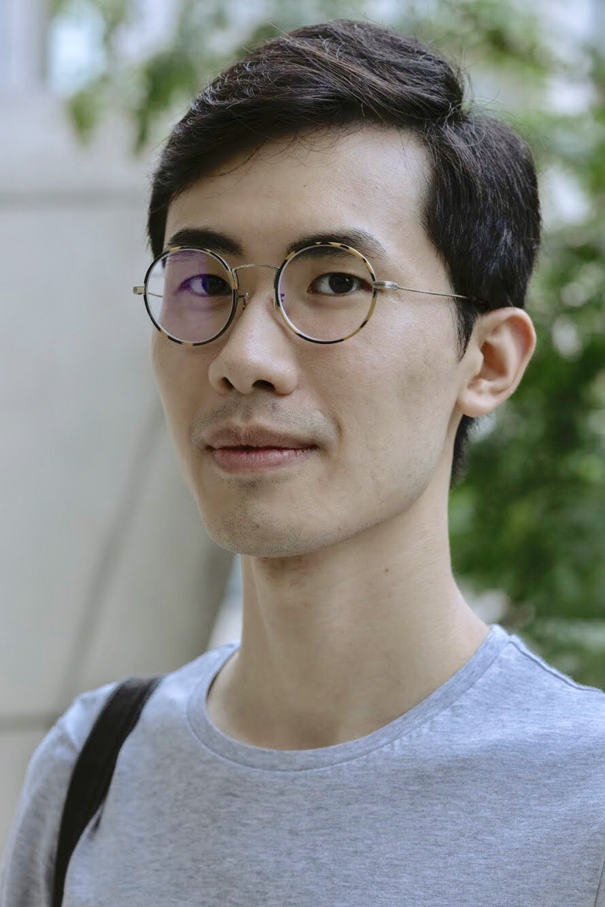

---
# Feel free to add content and custom Front Matter to this file.
# To modify the layout, see https://jekyllrb.com/docs/themes/#overriding-theme-defaults

layout: default
---

  
  

  I am a first year PhD student at the University of Notre Dame, where I am 
  working with <a href="https://www3.nd.edu/~nchawla/">Nitesh Chawla</a> in
  the <a href="https://www3.nd.edu/~dial/home/">DIAL lab</a>. Prior to 
  graduate school, I spent several years in industry. Before that, I did my 
  undergraduate studies at NYU. My research interests are in machine learning 
  and natural language processing.

